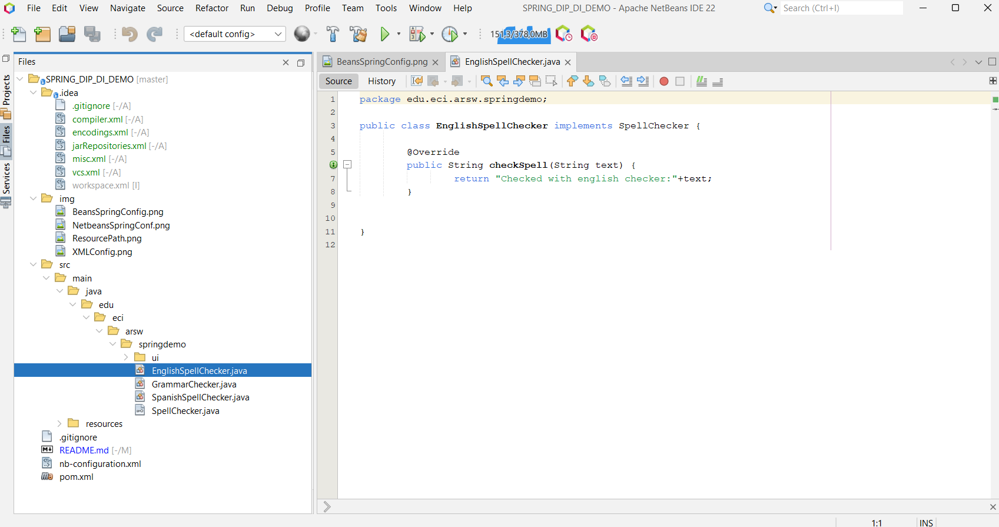
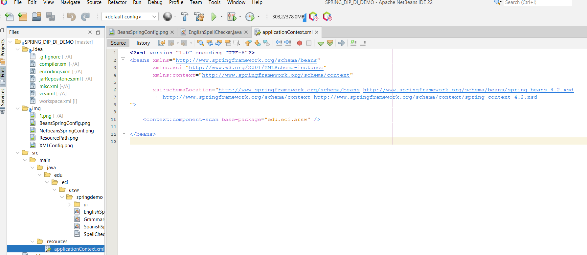
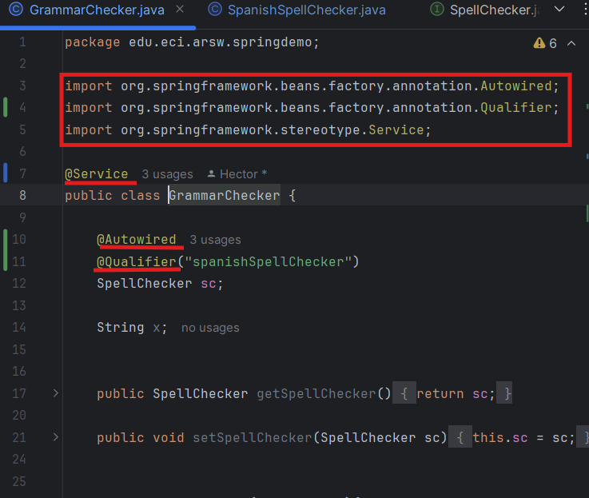
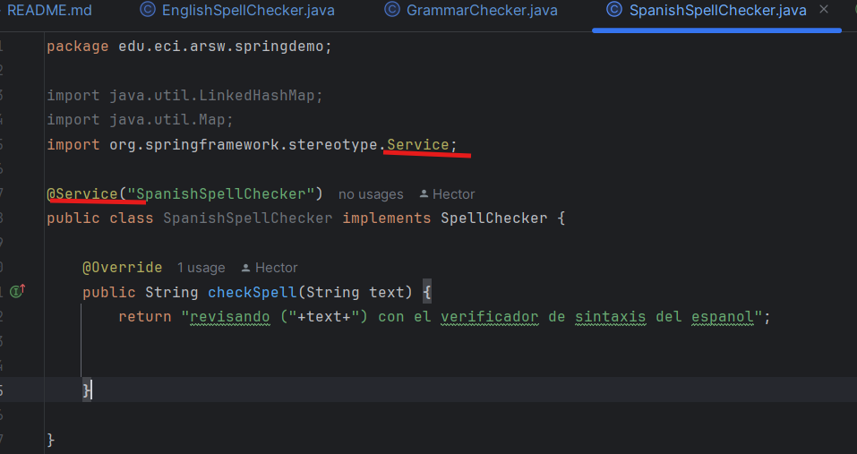
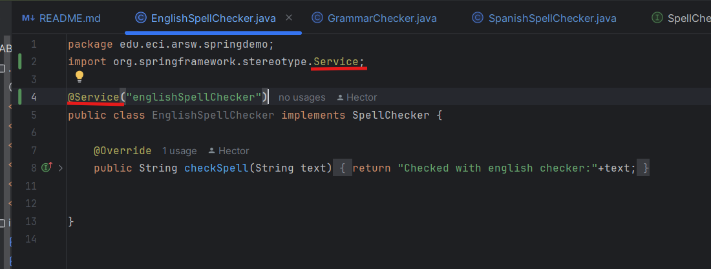

# Escuela Colombiana de Ingeniería
# Arquitecturas de Software - ARSW
### Taller – Principio de Inversión de dependencias, Contenedores Livianos e Inyección de dependencias.
#### AUTORES:
- [Saray Alieth Mendivelso](https://github.com/saraygonm)


### Parte I. Ejercicio básico.

Para ilustrar el uso del framework Spring, y el ambiente de desarrollo para el uso del mismo a través de Maven (y NetBeans), se hará la configuración de una aplicación de análisis de textos, que hace uso de un verificador gramatical que requiere de un corrector ortográfico. A dicho verificador gramatical se le inyectará, en tiempo de ejecución, el corrector ortográfico que se requiera (por ahora, hay dos disponibles: inglés y español).

1. Abra el los fuentes del proyecto en NetBeans.
- En el panel de Proyectos en el lado izquierdo de la ventana de NetBeans, 
se expande el nodo del proyecto. Evidenciando la estructura
de carpetas y archivos, incluyendo las carpetas típicas como src (fuentes),
build, y test.
<p align="center">

</p>


2. Revise el archivo de configuración de Spring ya incluido en el proyecto (src/main/resources). El mismo indica que Spring buscará automáticamente los 'Beans' disponibles en el paquete indicado.
1) Navegar a través de `src` > `main` > `resources`
2) Buscar un archivo con una extensión `.xml`, en este caso `applicationContext.xml` 
<p align="center">

</p>

- Después de seguir estos pasos encontramos que se está utilizando la etiqueta <context:component-scan> para especificar el paquete en el que Spring debe buscar automáticamente los 'Beans' (definicion de la interfaz), el paquete especificado es `edu.eci.arsw`.

3. Haciendo uso de la [configuración de Spring basada en anotaciones](https://docs.spring.io/spring-boot/docs/current/reference/html/using-boot-spring-beans-and-dependency-injection.html) marque con las anotaciones @Autowired y @Service las dependencias que deben inyectarse, y los 'beans' candidatos a ser inyectadas -respectivamente-:

	* GrammarChecker será un bean, que tiene como dependencia algo de tipo 'SpellChecker'.
	* EnglishSpellChecker y SpanishSpellChecker son los dos posibles candidatos a ser inyectados. Se debe seleccionar uno, u otro, mas NO ambos (habría conflicto de resolución de dependencias). Por ahora haga que se use EnglishSpellChecker.
 - `@Autowired` le dice a Spring que debe "inyectar" o "proveer" automáticamente un objeto cuando se necesita.
En términos más simples es un asistente que trae la herramienta correcta cuando le dicimos que lo que necesitamos.
- `@Service` marca una clase como un "servicio" dentro de la aplicación. Es una manera de decirle al Spring, "Esta clase hace trabajo de 
servicio y debe ser gestionada por el contenedor de Spring."

<p align="center">

</p>

### Explicación de Anotaciones en Spring

1. **Registro del Bean:**
	- **`@Service`** en la clase `GrammarChecker` indica al Spring que gestione esta clase como un Bean. Esto significa que Spring la detectará y la registrará automáticamente en su contenedor para su administración y uso.

2. **Inyección del Bean:**
	- **`@Autowired`** le dice a Spring que necesita inyectar una instancia del tipo `SpellChecker` en la clase `GrammarChecker`. Esta anotación permite que Spring se encargue de proporcionar el objeto necesario para el campo `sc`, facilitando la gestión de dependencias.

3. **Especificación del Bean:**
	- **`@Qualifier("spanishSpellChecker")`** indica a Spring que debe inyectar la instancia de `SpellChecker` que está etiquetada con `spanishSpellChecker`. Esta anotación es importante cuando hay múltiples Beans del tipo `SpellChecker` para evitar conflictos y asegurar que se use la implementación correcta.

<p align="center">

</p>

<p align="center">

</p>

las modificaciones anteriores es con el fin de garantizar que Spring registre esas clases como un Bean (objeto administrado por Spring) con el nombre


4. Haga un programa de prueba, donde se cree una instancia de GrammarChecker mediante Spring, y se haga uso de la misma:
	```java
	public static void main(String[] args) {
		ApplicationContext ac=new ClassPathXmlApplicationContext("applicationContext.xml");
		GrammarChecker gc=ac.getBean(GrammarChecker.class);
		System.out.println(gc.check("la la la "));
	}
	```
	
5. Modifique la configuración con anotaciones para que el Bean ‘GrammarChecker‘ ahora haga uso del  la clase SpanishSpellChecker (para que a GrammarChecker se le inyecte EnglishSpellChecker en lugar de  SpanishSpellChecker. Verifique el nuevo resultado.
